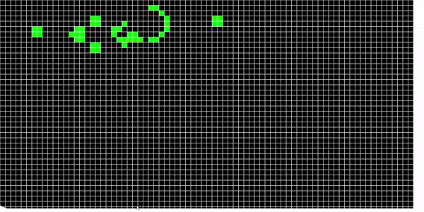

# Game of Life (GoL)

PyGame implementation of the famous cellular automaton John Conway's Game of Life. 
Users can activate any cell just by clicking on it and see the evolution of the system under the rules of the game.

**Rules of GoL**:
- If a cell is dead and has 3 neighbors alive, then the cell gets activated.
- If a cell is alive and has less than 2 neighbors, it dies.
- If a cell is alive and has more than 3 neighbors, it dies.
- If a cell is alive and has exactly 2 or 3 neighbors, it survives.

 
 
Example of a classic Glider Gun.
 
 

